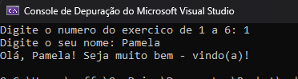
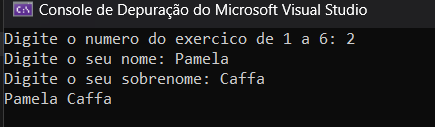
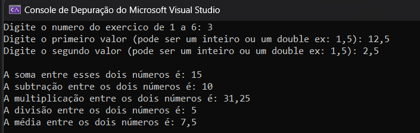
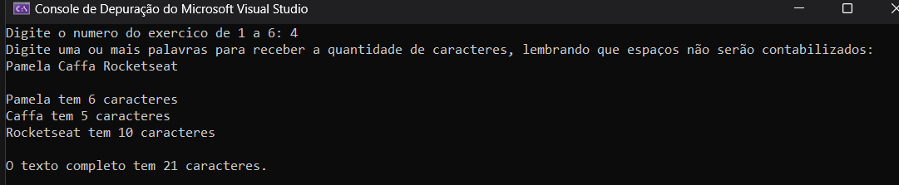
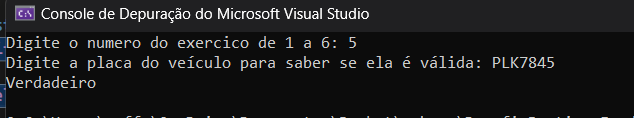
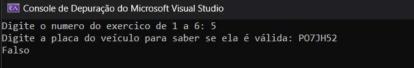
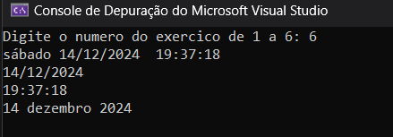

# Desafio prático - Fundamentos de C-Sharp

Repositório com o desafio prático da formação c# da Rocketseat 🚀, abaixo terá os Exercicios propostos e as evidências dos testes após o desenvolvimento dos mesmos.


### Exercícios práticos

1.  Crie um programa em que o usuário precisa digitar um nome e uma mensagem de boas vindas personalizada com o nome dele é exibida: **`Olá, Welisson! Seja muito bem-vindo!`**

_Obs: veja que o método para ler os dados que um usuário digita não foi passado em aula._ O que acha de começar com a sua primeira busca? 🔍

Caso não encontre, vou deixar uma dica aqui embaixo! 
- Dica 👀

```
    💡 O método para ler os dados que um usuário digita é o **`Console.ReadLine();`**    
```


----------

2.  Crie um programa que concatene um nome e um sobrenome inseridos pelo usuário e ao final exiba o nome completo.



----------
    
3.  Crie um programa com 2 valores do tipo **`double`** já declarados ****que retorne:
    
    -   A soma entre esses dois números;
    -   A subtração entre os dois números;
    -   A multiplicação entre os dois números;
    -   A divisão entre os dois números (vale uma verificação se o segundo número é 0!);
    -   A média entre os dois números.

```
💡 Você pode ir além e permitir que o usuário insira dois números aleatórios!
```



----------

4.  Crie um programa em que o usuário digita uma ou mais palavras e é exibido a quantidade de caracteres que a palavra inserida tem.

-   Dica
```
💡 Você pode fazer uma verificação e incrementar o contador apenas se for um caractere, ignorando os espaços caso o usuário digite mais que uma palavra, por exemplo.
```
 

----------

5.  Crie um programa em que o usuário precisa digitar a placa de um veículo e o programa verifica se a placa é válida, seguindo o padrão brasileiro válido até 2018:
    
    -   A placa deve ter 7 caracteres alfanuméricos;
    -   Os três primeiros caracteres são letras (maiúsculas ou minúsculas);
    -   Os quatro últimos caracteres são números;
    
    Ao final, o programa deve exibir _**Verdadeiro**_ se a placa for válida e _**Falso**_ caso contrário.
    
   - Placa válida:
 
   
   - Placa inválida:
 

----------
    
6.  Crie um programa que solicita ao usuário a exibição da data atual em diferentes formatos:
-   Formato completo (dia da semana, dia do mês, mês, ano, hora, minutos, segundos).
-   Apenas a data no formato "01/03/2024".
-   Apenas a hora no formato de 24 horas.
-   A data com o mês por extenso.

 